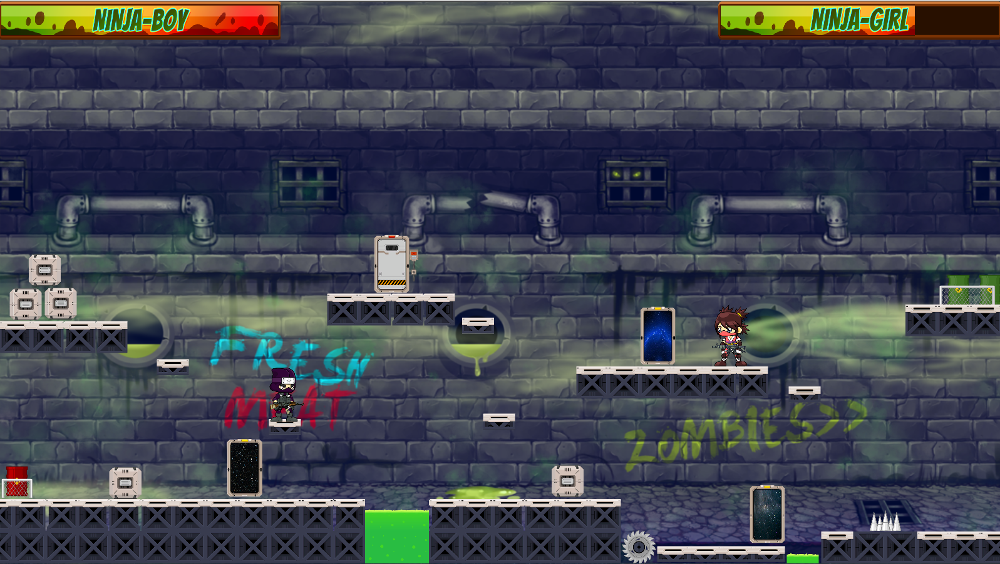

# SHOOTING ARENA
 1 VS 1 shooting platformer 2D game

Gra została stworzona za pomocą silnika Unity w języku C#.
Polega ona na rywalizacji dwóch graczy. Celem jest strzelanie do przeciwnika tak, aby poziom jego życia spadł do zera.
Wygrywa gracz,który ostatni pozostanie przy życiu.

Gra:

W grze znajdują się elemnty takie jak ruchome platformy, teleporty oraz zabójczy kwas.

------------------------------------------
Sterowanie

Gracz 1 : W,A,S,D,T
Gracz 2: UP,DOWN,LEFT,RIGHT,P
